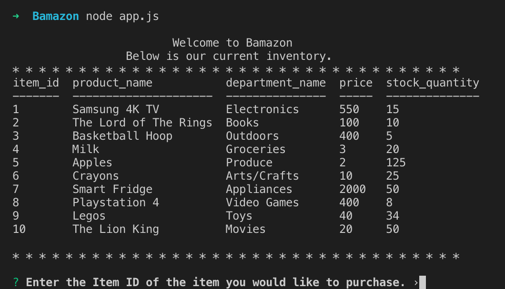
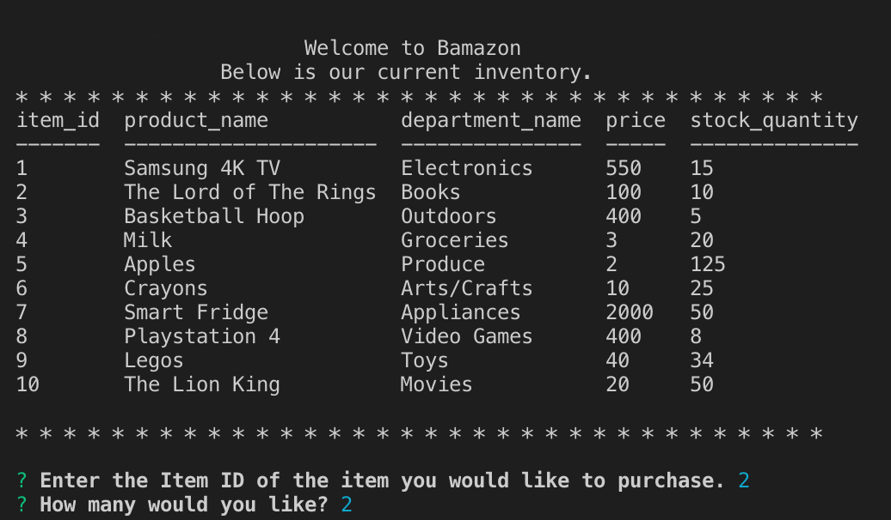
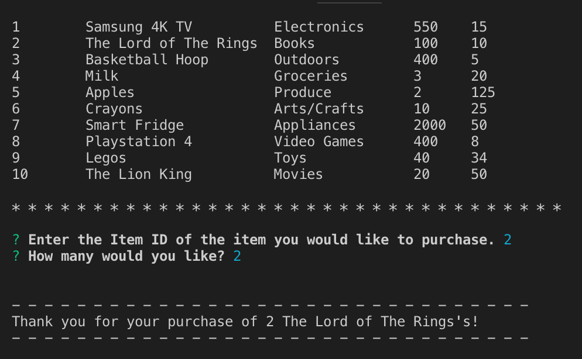
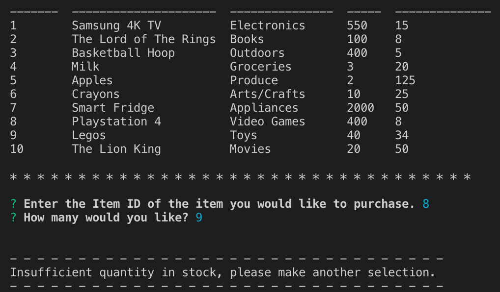
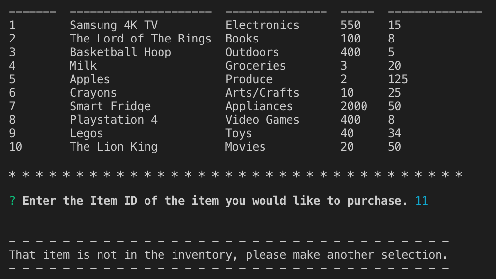

# Bamazon

## Overview
An amazon styled store app that uses an SQL Databse that contains products that the user may purchase and updates the stock quantity in real time. This app also uses the inquirer prompts for user choices as well as console.table for creating the product table from the database.

### Making purchase

### Not enough in stock

### Item ID does not exsist
